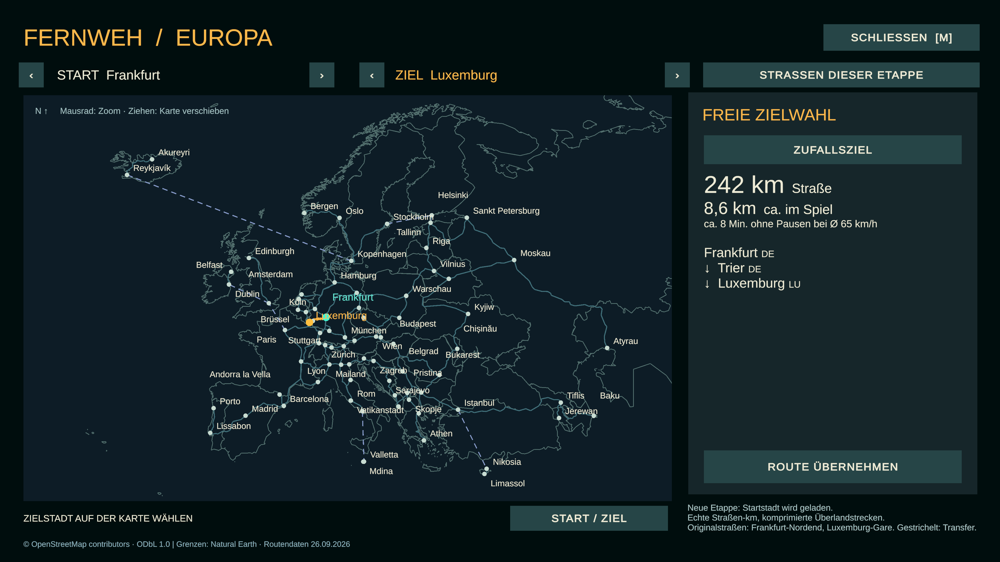

# Fernweh 1.5 · Europa & Somewhere in Europe

Ein früher Roadtrip-Prototyp für Windows von Luis Studios, gebaut mit Unity. Mit einem alten Pickup durch verkürzte europäische Landschaften fahren, aussteigen, einkaufen und Orte entdecken. Allein oder mit bis zu drei Spielern.

[English](README.en.md) · [Asset-Credits](CREDITS.md) · [Downloads](https://github.com/chipslisaurus/fernweh-roadtrip/releases)

## Somewhere in Europe

Im Hauptmenü **Somewhere in Europe** wählen, einen Raum erstellen und den Code an Freunde schicken. Jeder erhält einen eigenen Pickup und startet an einem anderen, unbekannten Punkt derselben Strecke. Bis zu drei Spieler; ab zwei Spielern kann die Runde gewonnen werden.

Es gibt **kein Navi, keine Karte, keine Ortsanzeige und keine Freundesmarker**. Der Kompass zeigt die Blickrichtung. Nutzt Schilder, Straßennummern und auffällige Gebäude, beschreibt euch eure Umgebung und fahrt zueinander. Für Gespräche einen eigenen Sprachchat verwenden; Fernweh enthält keinen Sprachchat.

**Rundenziel:** Alle verbundenen Spieler müssen ihre Pickups mindestens vier Sekunden innerhalb von 35 Metern zusammen abstellen. Danach könnt ihr gemeinsam weiterfahren. Unter **F1 → Neue Suchrunde** kann der Gastgeber neue Startpunkte laden, sobald alle wieder eingestiegen sind und stehen.

**Gemeinsam im Pickup** bleibt verfügbar: Gastgeber fährt, zwei Freunde sitzen auf der Beifahrerbank und können gemeinsam aussteigen. Alle benötigen dieselbe Version 1.5.

## Europa und Straßen

- **80 Orte und 101 Verbindungen** über Europa, einschließlich Inseln, Kleinstaaten und ausgewählter transkontinentaler Gebiete. Enthalten sind 51 Länder-/Gebietscodes; das ist keine politische Definition Europas.
- **M** öffnet außerhalb des Suchmodus die Europakarte. Start und Ziel anklicken oder durchschalten, zoomen, die Karte ziehen oder ein zufälliges Ziel wählen. Neue Etappen werden im Stand geladen.
- Straßenentfernungen stammen aus OpenStreetMap/OSRM. Rückrichtungen verwenden näherungsweise denselben Wert. Fahrzeuge bleiben lebensgroß, Zwischenstrecken werden stark verkürzt und enge Radien geglättet.
- Überlandkurven nutzen die Richtungswechsel der importierten Routen. Die Straße ist eine **generalisierte, komprimierte Interpretation**, keine geografisch maßstabsgetreue Kopie. Gelände und Gebäude sind größtenteils prozedural.
- **Frankfurt-Nordend und Luxemburg-Gare** nutzen importierte Straßen- und Gebäudegrundrisse. Fassaden und viele Höhen sind vereinfacht; andere Stadtstraßen entstehen prozedural.
- Gestrichelte Inselverbindungen sind **fiktive Fahrzeugtransfers**, keine gemessenen Straßen. Am Terminal anhalten und **E** drücken. Entfernungen sind grobe Luftlinienwerte. Es gibt keine Fährsimulation; diese Verbindungen bilden keine realen Verkehrsangebote ab.
- Neue Gegenrichtungsbeschilderung, Autobahntafeln, Wassertürme, Silos und Funkmasten ergänzen Felder, Höfe und Erkundungsorte. Der überstrahlende Reflex der Windschutzscheibe wurde entfernt.

Freie Etappen reichen von etwa 3,8 bis 157 Spielkilometern. Somewhere in Europe wählt normalerweise kürzere Strecken ohne Transfers. Die Karte beschreibt keine aktuell passierbaren Grenzen und ist keine Reiseempfehlung.

## Starten und Freunde einladen

Den vollständigen ZIP-Download entpacken und **Fernweh.exe** starten. Den Datenordner und die Unity-Laufzeitdateien daneben lassen. Namen und Figur wählen; dann allein aufbrechen, einen Raum erstellen oder einen Raumcode eingeben. Der Internetmodus nutzt Unity Relay; LAN Host und LAN Beitreten funktionieren im lokalen Netzwerk.

Der Gastgeber muss verbunden bleiben. Hostwechsel, sitzungsübergreifende Multiplayer-Spielstände und eingebaute Sprachübertragung sind nicht enthalten. Es bleibt ein Prototyp mit vereinfachter Umgebung.

## Steuerung

| Taste | Aktion |
|---|---|
| WASD, Maus | Fahren/laufen, umsehen |
| F | Im Stand ein-/aussteigen |
| Leertaste | Handbremse / springen |
| E | Tanken, Gespräch, Shop, Fahrzeugtransfer |
| R | Pannenhilfe |
| I, L, B | Motor, Außenlicht/Taschenlampe, Innenlicht |
| Z / X, V | Blinker, Hupe |
| Q / G | Gegenstände; Hinweise im Spiel beachten |
| M, Tab, J | Europakarte, Navi, Reisebuch; im Suchmodus ausgeschaltet |
| K | Mit Entdeckungsorten interagieren |
| F1, Esc | Hauptmenü/Raum, Pause |

Tankstellen und Rastplätze enthalten zeitabhängige Besucher; Shops bieten physische Gegenstände. Verfügbare Entdeckungsorte hängen von der gewählten Etappe ab. Gemeinsam-im-Pickup enthält zusätzliche Crew-Aufträge.

## Kartendaten

Kartendaten © [OpenStreetMap contributors](https://www.openstreetmap.org/copyright), [ODbL 1.0](https://opendatacommons.org/licenses/odbl/1-0/), über OSRM abgerufen am 26.09.2026. Länderumrisse: [Natural Earth](https://www.naturalearthdata.com/about/terms-of-use/), public domain.

Die verwendete abgeleitete Datenbank liegt maschinenlesbar unter [data/Fernweh-Europe-ODbL.json](data/Fernweh-Europe-ODbL.json) im Repository und Download. Die Datenlizenz gilt nicht für den vollständigen Spielcode. Weitere Quellen: [CREDITS.md](CREDITS.md), [THIRD-PARTY-NOTICES.md](THIRD-PARTY-NOTICES.md).
